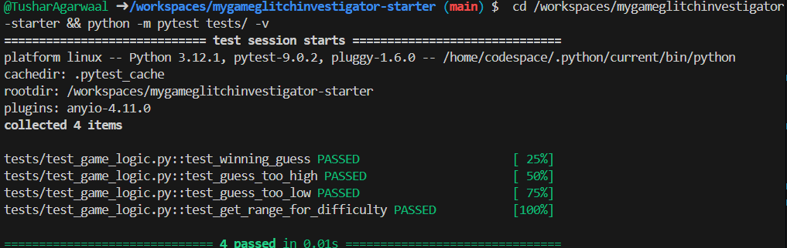
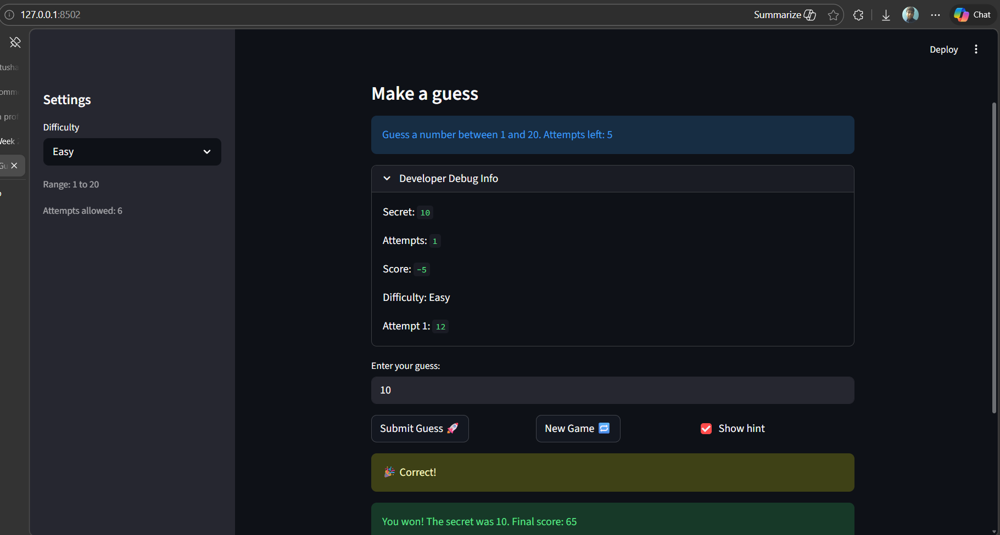

# 🎮 Game Glitch Investigator: The Impossible Guesser

## 🚨 The Situation

You asked an AI to build a simple "Number Guessing Game" using Streamlit.
It wrote the code, ran away, and now the game is unplayable. 

- You can't win.
- The hints lie to you.
- The secret number seems to have commitment issues.

## 🛠️ Setup

1. Install dependencies: `pip install -r requirements.txt`
2. Run the broken app: `python -m streamlit run app.py`

## 🕵️‍♂️ Your Mission

1. **Play the game.** Open the "Developer Debug Info" tab in the app to see the secret number. Try to win.
2. **Find the State Bug.** Why does the secret number change every time you click "Submit"? Ask Claude: *"How do I keep a variable from resetting in Streamlit when I click a button?"*
3. **Fix the Logic.** The hints ("Higher/Lower") are wrong. Fix them.
4. **Refactor & Test.** - Move the logic into `logic_utils.py`.
   - Run `pytest` in your terminal.
   - Keep fixing until all tests pass!

## 📝 Your Experience

- [ ] Game's purpose.
  
The game's purpose is to provide a simple number guessing experience where the player tries to guess a randomly selected secret number. The game gives feedback after each guess, helping the player narrow down the possibilities until they find the correct answer.

- [ ] Detail which bugs you found.

   - The secret number changed every time the "Submit" button was clicked, making it impossible to win.
   - The hints ("Higher" or "Lower") were incorrect and did not accurately reflect the relationship between the guess and the secret number.

- [ ] Explain what fixes you applied.

   - Used Streamlit's `st.session_state` to store the secret number so it persists across interactions and doesn't reset on each guess.
   - Corrected the logic for the hints to ensure they provide accurate feedback based on the player's guess compared to the secret number. 
============================= test session starts ==============================
platform linux -- Python 3.12.1, pytest-9.0.2, pluggy-1.6.0 -- /home/codespace/.python/current/bin/python
cachedir: .pytest_cache
rootdir: /workspaces/mygameglitchinvestigator-starter
plugins: anyio-4.11.0
collected 4 items                                                              

tests/test_game_logic.py::test_winning_guess PASSED                      [ 25%]
tests/test_game_logic.py::test_guess_too_high PASSED                     [ 50%]
tests/test_game_logic.py::test_guess_too_low PASSED                      [ 75%]
tests/test_game_logic.py::test_get_range_for_difficulty PASSED           [100%]

============================== 4 passed in 0.01s ===============================

## 📸 Demo

- [ ] 
